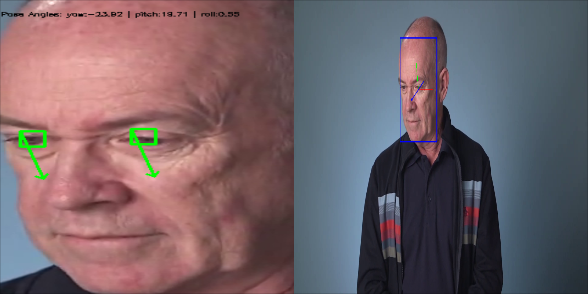

# Computer Pointer Controller

In this project, it is use a gaze detection model to control the mouse pointer of the computer.
It is use the InferenceEngine API from Intel's OpenVino ToolKit. The gaze estimation model requires three inputs:
 - The head pose.
 - The left eye image.
 - The right eye image.
 
The flow of data used is:


## Project Set Up and Installation

#### Step 1
You need to install openvino successfully.
See this guide for installing [OpenVino ToolKit](https://software.intel.com/content/www/us/en/develop/tools/openvino-toolkit/choose-download.html).

#### Step 2
Clone the repository from this URL: https://github.com/davisclick/openvino-eye-gaze-estimation.

#### Step 3
After you clone the repo, you need to install the dependecies.

	pip3 install -r requirements.txt

#### Step 4
Create Virtual Enviorment in working directory.

 	python3 -m venv venv

#### Step 5
Activate Virtual Enviorment.

 	source venv/bin/activate

#### Step 6
Initialize the openVINO environment.

	source /opt/intel/openvino/bin/setupvars.sh -pyver 3.6

#### Step 7
Download the following models by using openVINO model downloader.

	cd models

**[Face Detection Model](https://docs.openvinotoolkit.org/latest/_models_intel_face_detection_adas_binary_0001_description_face_detection_adas_binary_0001.html)**
 ```
	python /opt/intel/openvino/deployment_tools/tools/model_downloader/downloader.py --name "face-detection-adas-0001"
 ```
**[Facial Landmarks Detection Model](https://docs.openvinotoolkit.org/latest/_models_intel_landmarks_regression_retail_0009_description_landmarks_regression_retail_0009.html)**
 ```
	python /opt/intel/openvino/deployment_tools/tools/model_downloader/downloader.py --name "landmarks-regression-retail-0009"
 ```
**[Head Pose Estimation Model](https://docs.openvinotoolkit.org/latest/_models_intel_head_pose_estimation_adas_0001_description_head_pose_estimation_adas_0001.html)**
 ```
	python /opt/intel/openvino/deployment_tools/tools/model_downloader/downloader.py --name "head-pose-estimation-adas-0001"
 ```
**[Gaze Estimation Model](https://docs.openvinotoolkit.org/latest/_models_intel_gaze_estimation_adas_0002_description_gaze_estimation_adas_0002.html)**
 ```
	python /opt/intel/openvino/deployment_tools/tools/model_downloader/downloader.py --name "gaze-estimation-adas-0002"
 ```

## Demo

### Run command: 
 ```
python3 src/main.py -fd ../models/intel/face-detection-adas-0001/FP16/face-detection-adas-0001 
-fl ../models/intel/landmarks-regression-retail-0009/FP16/landmarks-regression-retail-0009 
-hp ../models/intel/head-pose-estimation-adas-0001/FP16/head-pose-estimation-adas-0001 
-ge ../models/intel/gaze-estimation-adas-0002/FP16/gaze-estimation-adas-0002 
-i ../media/demo.mp4 -d CPU -pof fd fl hp ge
 ```



## Documentation

### Used Models

1. [Face Detection Model](https://docs.openvinotoolkit.org/latest/_models_intel_face_detection_adas_binary_0001_description_face_detection_adas_binary_0001.html)
2. [Facial Landmarks Detection Model](https://docs.openvinotoolkit.org/latest/_models_intel_landmarks_regression_retail_0009_description_landmarks_regression_retail_0009.html)
3. [Head Pose Estimation Model](https://docs.openvinotoolkit.org/latest/_models_intel_head_pose_estimation_adas_0001_description_head_pose_estimation_adas_0001.html)
4. [Gaze Estimation Model](https://docs.openvinotoolkit.org/latest/_models_intel_gaze_estimation_adas_0002_description_gaze_estimation_adas_0002.html)

### Command Line Arguments for Running the app

Argument|Type|Description
| ------------- | ------------- | -------------
-fd | Required | Path to .xml file of Face Detection model.
-fl | Required | Path to .xml file of Facial Landmark Detection model.
-hp| Required | Path to .xml file of Head Pose Estimation model.
-ge| Required | Path to .xml file of Gaze Estimation model.
-i| Required | Specify the path of input video file or enter cam for taking input video from webcam.
-l| Optional | Absolute path to a shared library with the kernels impl.
-d | Optional | Provide the target device: CPU / GPU / MYRIAD / FPGA
-pt  | Optional | Probability threshold for detections filtering.
-pof | Optional | Specify the flags from fd, fl, hp, ge if you want to visualize the output of corresponding models of each frame (write flags with space seperation. Ex:- -flags fd fld hp).

 ### Project Directory Structure
  ```bash
computer-pointer-controller  
|
|--media
|   |--demo.mp4
|   |--demo.png
|   |--pipeline.mp4
|--models
|   |--face-detection-adas-binary-0001
|   |--gaze-estimation-adas-0002
|   |--head-pose-estimation-adas-0001
|   |--landmarks-regression-retail-0009
|--README.md
|--requirements.txt
|--src
    |--face_detection.py
    |--facial_landmarks_detection.py
    |--gaze_estimation.py
    |--head_pose_estimation.py
    |--input_feeder.py
    |--main.py
    |--mouse_controller.py
```
- <b>media</b> Folder with the media files.
- <b>models</b> Folder with the pre-trained models from Open Model Zoo.
    - intel
        1. face-detection-adas-binary-0001
        2. gaze-estimation-adas-0002
        3. head-pose-estimation-adas-0001
        4. landmarks-regression-retail-0009
- <b>src</b> Folder with the python files of the app.
    + [face_detection.py](./src/face_detection.py) : Face Detection related inference code.
    + [facial_landmarks_detection.py](./src/facial_landmarks_detection.py) : Take the deteted face as input, preprocessed it, perform inference on it and detect the eye landmarks, postprocess the outputs.
    + [gaze_estimation.py](./src/gaze_estimation.py) : Gaze Estimation related inference code.
    + [head_pose_estimation.py](./src/head_pose_estimation.py) : Head Pose Estimation related inference code.
    + [input_feeder.py](./src/input_feeder.py) : Contains InputFeeder class which initialize VideoCapture as per the user argument and return the frames one by one.
	+ [main.py](./src/driver.py) : Main script to run the app.
    + [mouse_controller.py](./src/mouse_controller.py) : Contains MouseController class which take x, y coordinates value, speed, precisions and according these values it moves the mouse pointer by using pyautogui library.
    + [profiling.py](./src/profiling.py) : To check performance of script line by line.
   
- <b>README.md</b> What you are reading now.
- <b>requirements.txt</b> All the dependencies of the project listed here.

## Benchmarks

* Using the [Intel® DevCloud](https://devcloud.intel.com/edge/)
  * IEI Tank 870-Q170 - The inference workload should run on the CPU.
  * IEI Tank 870-Q170 - The inference workload should run on the Intel® HD Graphics 530 integrated GPU.
  * IEI Tank 870-Q170 - The inference workload will run on the IEI Mustang-F100-A10 FPGA card installed in this node.
  

* for FP32(time in seconds)
  | Type of Hardware | Total inference time                         | Time for loading the model | fps |
  |------------------|----------------------------------------------|----------------------------|------
  | CPU              |  69                                          |  1.5                       |  9  |
  | GPU              |  70                                          |  55                        |  9  |
  | FPGA             |  118                                         |  6.5                       |  5  |

* for FP16(time in seconds)
  | Type of Hardware | Total inference time 	                    | Time for loading the model | fps |
  |------------------|----------------------------------------------|----------------------------|------
  | CPU              |  78                                          |  1.4                       |  8  |
  | GPU              |  75                                          |  53                      	 |  9  |
  | FPGA             |  125                                         |  4.5                       |  5  |

* for INT8(time in seconds)
  | Type of Hardware | Total inference time                         | Time for loading the model | fps |
  |------------------|----------------------------------------------|----------------------------|------
  | CPU              |  79                                          |  1.4                       |  8  |
  | GPU              |  74                                          |  52 .4                     |  9  |
  | FPGA             |  130                                         |  3                         |  5  |

## Results

- The loading model time for GPU is larger than CPU and FPGA.
- Reducing the precision affects the accuracy.
- FPGA take more time executing inferences. 

### Async Inference
It is used the start_async method, but it is not a truly async mode.

### Edge Cases

- If there is more than one face detected, it extracts only one face and do inference on it and ignoring other faces.
- Moving the mouse pointer out of the maximum window width, will finished the app. 
